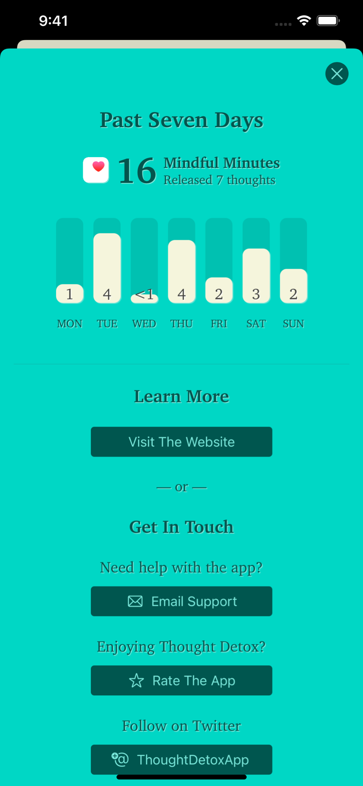
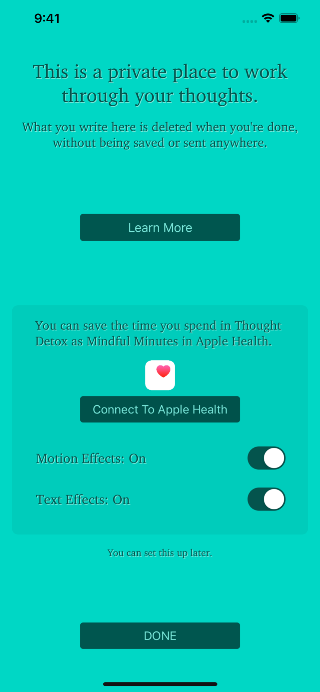

# Thought Detox Press Kit

## tl;dr:

Work through what's on your mind, with complete peace of mind. Thought Detox's clean, peaceful interface lets you get negative thoughts out of your head, without storing or sending them anywhere.

## What is Thought Detox?

Writing down your negative thoughts and then discarding them can [help you find peace][psychtoday]. Thought Detox is an iPhone app that lets you mindfully work through those most private thoughts, on your most personal device.

Want to see how that mindfulness affects your week? Connect the app to Apple Health to track the time you spend working through negative thoughts. See those mindfulness trends over the past seven days in the app, or add them to your home screen as a widget. Thought Detox even integrates with [Wind Down][winddown], to let you quickly clear your head before bed.

Learn more on the [app website][website] (coming soon!), follow the [Dropped Bits Twitter account][twitter], or [email me][mailto] and I'll be happy to answer your questions.

## Work through your most private thoughts, on your most personal device.

- The simple, peaceful interface keeps you focused on writing.
- Work through your thoughts in complete privacy: what you write is deleted when you release the thought.
- Track your time using the app as Mindful Minutes in Apple Health.
- Built with SwiftUI, leveraging new iOS 14 features:
	- Add widgets to view the past seven days of Mindful Minutes statistics on your home screen.
	- Integrates with Wind Down, to help you clear your head before bed.

## Pricing

Thought Detox is a paid app, with no in-app purchases or subscriptions. It will cost USD$2.99, with a sale price of USD$0.99 for the first 48 hours after launch. The most up-to-date pricing is available on the [App Store product page][appstore].

(Why charge for the app? Because I can't protect anyone's privacy if I have to sell data to advertisers.)

## Availability

Thought Detox will launch on the App Store Monday, 15 February, 2021.

[][appstore]

## Who created Thought Detox?

[Angelo Stavrow][me]. He's an iOS and web developer living in Montreal, Canada, who spends a lot of time thinking about the intersection of tech and self-care. Hear him discuss this topic with Anil Dash on the [Function podcast][function].

## Media

Feel free to use these images and videos in reviews of Thought Detox. Retina versions (@2x and @3x) of screenshots are available in the Images folder.

### Promotional media

<!-- !["Short animated overview"][rotato.mp4] -->

### iPhone screenshots

### App icon

<!--references-->
[psychtoday]: https://www.psychologytoday.com/us/blog/choke/201301/throw-those-nasty-thoughts-away
[winddown]: https://support.apple.com/en-ca/guide/iphone/iph2d7daf6fc/ios
[website]: https://thoughtdetox.app
[twitter]: https://twitter.com/DroppedBitsHQ
[mailto]: mailto:angelo@droppedbits.com
[appstore]: https://apps.apple.com/app/thought-detox/id1534491093
[me]: https://angelostavrow.com
[function]: https://podcasts.apple.com/us/podcast/we-cant-just-log-off-mental-health-and-tech/id1439658455?i=1000452023198

---

Credit for lifestyle.png background: Photo by <a href="https://unsplash.com/@johnsalzarulo?utm_source=unsplash&amp;utm_medium=referral&amp;utm_content=creditCopyText">John Salzarulo</a> on <a href="https://unsplash.com/?utm_source=unsplash&amp;utm_medium=referral&amp;utm_content=creditCopyText">Unsplash</a>.
